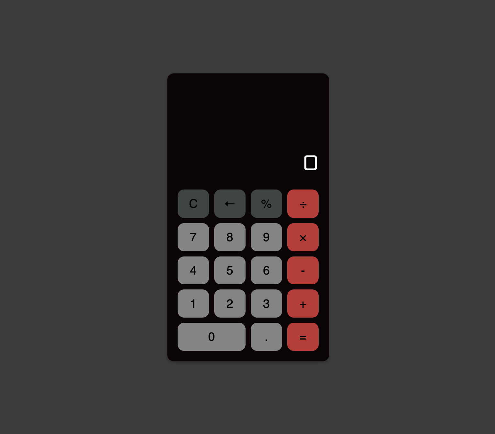

# Basic Calculator

This is a basic calculator project that I created for practice using HTML, CSS, and vanilla JavaScript. It features a user-friendly interface with various functions including addition, subtraction, multiplication, division, percentage calculation, clearing the display, and deleting the last input. The calculator can also be used with a keyboard for convenient input.

<br>

## Demo

</img>

<br>

## Features

- Addition, subtraction, multiplication, and division operations.
- Percentage calculation to quickly determine percentages.
- Clear button to reset the calculator and start fresh.
- Delete button to remove the last input.
- Keyboard support for convenient input.

<br>

## Keyboard Shortcuts

- 0-9: Enter digits.
- +: Perform addition.
- -: Perform subtraction.
- \*: Perform multiplication.
- /: Perform division.
- %: Calculate percentage.
- Enter/Return: Perform calculation.
- Backspace: Delete the last input.
- Escape: Clear the calculator display.

<br>

## Technologies Used

HTML5
CSS3
JavaScript

<br>

## Usage

1. Clone the repository:

```bash
git clone https://github.com/mini-project.git
```

2. Open the index.html file in your web browser.
3. Use the buttons on the calculator interface or the keyboard to perform calculations.

<br>

## Customization

Feel free to customize the calculator according to your needs. You can modify the HTML and CSS files to change the visual appearance or add additional functionality using JavaScript.

<br>

## License

This project is licensed under the MIT License.
