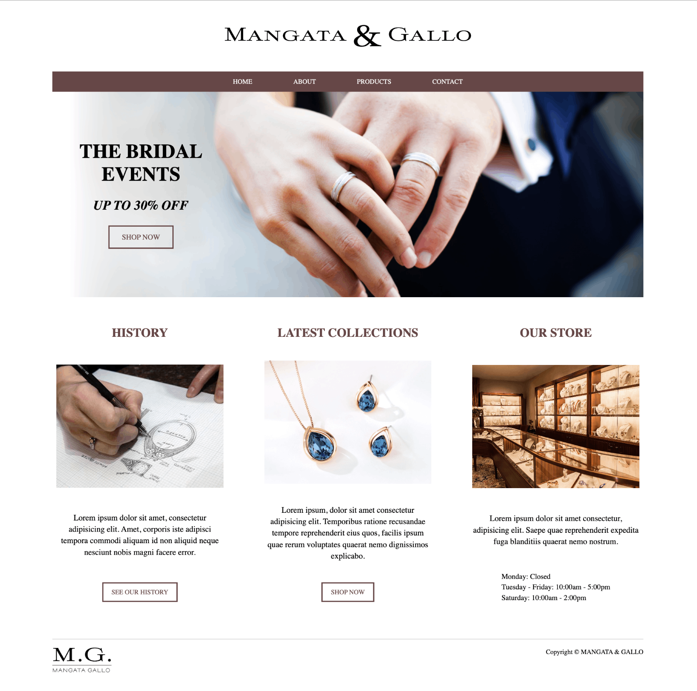

# Mangata and Gallo Jewelry Shop - Home Page

This project is a simple home page created as part of the 'HTML and CSS in Depth' course for the Meta Front-End Developer Professional Certificate. The goal of the assignment was to design a home page for an imaginary client, 'Mangata and Gallo,' a jewelry shop. The page incorporates offered images in semantic structures using CSS Grid or Flexbox and includes a promotional banner.

<br>

## Demo

<p align='center'></p>

<br>

## Features

- Responsive design for different screen sizes.
- Semantic HTML structure for accessibility and SEO.
- CSS Grid/Flexbox used for layout and positioning.
- Stylish promotional banner showcasing special offers.
- High-quality images provided for visual appeal.

<br>

## Technologies Used

- HTML5
- CSS3
- CSS Grid
- Flexbox

<br>

## Installation

1. Clone the repository:

```bash
  git clone https://github.com/your-username/mangata-gallo-jewelry.git
```

2. Open the index.html file in your web browser.

<br>

## Usage

Feel free to use this home page as a template for your own jewelry shop projects. Customize the content, layout, and styling to suit your needs. Modify the HTML and CSS files to incorporate your branding, images, and text.

<br>

## Credits

- Meta Front-End Developer Professional Certificate course materials and guidance.
- Images provided by the course resources (owned by their respective creators).
